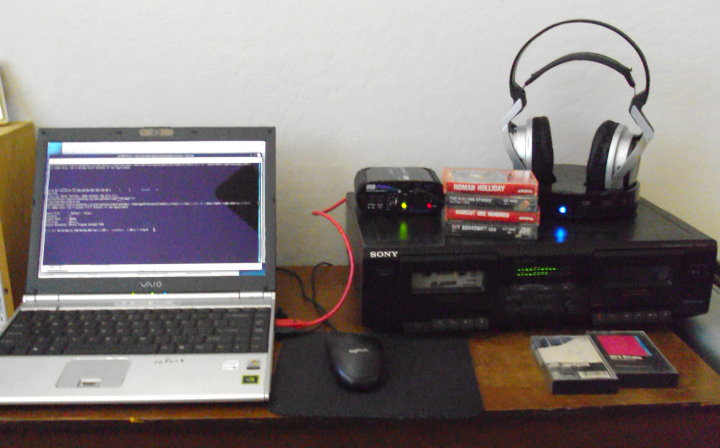
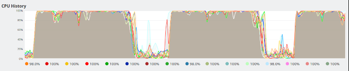

# AUDX - Audio Exchange

Digital audio utilities.

* [Cassette Rip Utilities](#cassette-rip-utilities)
* [FLAC File Utilities](#flac-file-utilities)
* [M4A File Utilities](#m4a-file-utilities)
* [Music Collection Utilities](#music-collection-utilities)
* [License & Usage](#licence--usage)

## Cassette Rip Utilities

## rip-c - Rip audio cassettes.

Record, split, and re-encode analog audio from cassette or vinyl.

### rip-c

```
rip-c.sh - Rip audio cassettes.
Usage: rip-c.sh [flags]
Option flags:
  --base-name       - Output file base name. Default: '/tmp/audx-rip'.
  --start-duration  - Silence start duration. Default: '0.2'.
  --start-threshold - Silence start threshold. Default: '0.6%'.
  --end-duration    - Silence end duration. Default: '2.0'.
  --end-threshold   - Silence end threshold. Default: '0.6%'.
  -f --force        - Force overwrite if exisitng output file.
  -c --config-file  - Configuration file. Default: ''.
  -h --help        - Show this help and exit.
  -v --verbose     - Verbose execution.
  -g --debug       - Extra verbose execution.
Option steps:
  -1 --rip-sox      - Rip to sox file.
  -2 --split-sox    - Split sox file.
  -3 --encode-flac  - Encode to flac.
Info:
  AUDX rip-c.sh
  Project Home: https://github.com/glevand/audx
```

### rip-c-to-flac
```
rip-c-to-flac.sh - Encode SOX files as FLAC.
Usage: rip-c-to-flac.sh [flags] top-dir
Option flags:
  -h --help        - Show this help and exit.
  -v --verbose     - Verbose execution.
  -g --debug       - Extra verbose execution.
Info:
  AUDX rip-c-to-flac.sh
  Project Home: https://github.com/glevand/audx
```

### rip-c-flac-tags
```
rip-c-flac-tags.sh - Add FLAC metadata tags to rip-c files.
Usage: rip-c-flac-tags.sh [flags] top-dir
Option flags:
  -h --help        - Show this help and exit.
  -v --verbose     - Verbose execution.
  -g --debug       - Extra verbose execution.
Info:
  AUDX rip-c-flac-tags.sh
  Project Home: https://github.com/glevand/audx
```

### rip-c Equipment



* [Sony VGN-SZ330P VAIO Notebook](https://www.newegg.com/sony-vaio-sz-series-vgn-sz330p-b/p/N82E16834117394).
* [ART USB Phono Plus Audio Interface](https://artproaudio.com/product/usb-phono-plus-project-series).
* [Sony TC-WE305 Dual Cassette Deck](https://www.sony.com/electronics/support/audio-components-cassette-decks).
* [Sony MDR-DS6000 Wireless Headphones](https://www.crutchfield.com/S-qvDLUN72Ckb/p_158MDR6000/Sony-MDR-DS6000.html).

## FLAC File Utilities

### flac-print-tags - Recursively print FLAC metadata tags.

```
flac-print-tags.sh - Recursively print FLAC metadata tags.
Usage: flac-print-tags.sh [flags] <top-dir|file>
Option flags:
  -a --all     - Print the VORBIS_COMMENT block.
  -h --help    - Show this help and exit.
  -v --verbose - Verbose execution.
  -g --debug   - Extra verbose execution.
Info:
  AUDX flac-print-tags.sh
  Project Home: https://github.com/glevand/audx
```

### flac-write-tag - Write new FLAC metadata tags.

```
flac-write-tag.sh - Write new FLAC metadata tags using --tag, or --tag-name and --tag-value.
Usage: flac-write-tag.sh [flags] <top-dir|file>
Option flags:
  -t --tag         - Full tag 'NAME=VALUE'. An empty VALUE will delete tag.  Default=''.
  -h --help        - Show this help and exit.
  -v --verbose     - Verbose execution.
  -g --debug       - Extra verbose execution.
  -d --dry-run     - Dry run, don't modify files.
Common tags:
  ARTIST
  ALBUM
  TITLE
  GENRE
  DATE
  TRACKNUMBER
  TRACKTOTAL
Examples:
  flac-write-tag.sh.in  --tag='ALBUM=No Jacket Required' "${collection}/Phil Collins/No Jacket Required"
  flac-write-tag.sh.in  --tag='ARTIST=Ultravox' "${collection}/Ultravox"
  flac-write-tag.sh.in  --tag='COMMENT=' "${collection}/Bruce Cockburn/Stealing Fire"
Info:
  AUDX flac-write-tag.sh
  Project Home: https://github.com/glevand/audx
```

### flac-add-tracktotal - Add FLAC tracktotal metadata tags.

```
flac-add-tracktotal.sh - Add FLAC tracktotal metadata tags.
Usage: flac-add-tracktotal.sh [flags] top-dir
Option flags:
  -h --help        - Show this help and exit.
  -v --verbose     - Verbose execution.
  -g --debug       - Extra verbose execution.
  -d --dry-run     - Dry run, don't modify files.
Info:
  AUDX flac-add-tracktotal.sh
  Project Home: https://github.com/glevand/audx
```

### flac-clean-tags - Clean FLAC metadata tags using standard rules.

```
flac-clean-tags.sh - Clean FLAC metadata tags using standard rules.
Usage: flac-clean-tags.sh [flags] top-dir
Option flags:
  -h --help        - Show this help and exit.
  -v --verbose     - Verbose execution.
  -g --debug       - Extra verbose execution.
  -d --dry-run     - Dry run, don't modify files.
Info:
  AUDX flac-clean-tags.sh
  Project Home: https://github.com/glevand/audx
```

### flac-meta-rename - Rename files based on FLAC metadata tags.

```
flac-meta-rename.sh - Rename files based on FLAC metadata tags.
Usage: flac-meta-rename.sh [flags] top-dir
Option flags:
  -a --various - Use 'Various Artists' logic.
  -h --help    - Show this help and exit.
  -v --verbose - Verbose execution.
  -g --debug   - Extra verbose execution.
  -d --dry-run - Dry run, don't rename files.
Info:
  AUDX flac-meta-rename.sh
  Project Home: https://github.com/glevand/audx
```

### flac-tag-switcher - Swap FLAC title/artist tags.

```
flac-tag-switcher.sh - Swap FLAC title/artist tags.
Usage: flac-tag-switcher.sh [flags] <top-dir|file>
Option flags:
  -o --output-dir - Output directory. Default: '/tmp/audx-switcher'.
  -c --clobber    - Overwrite existing files. Default: ''.
  -r --rename     - Rename output files ${track}-${artist} - ${title}.
  -h --help       - Show this help and exit.
  -v --verbose    - Verbose execution.
  -g --debug      - Extra verbose execution.
Info:
  AUDX flac-tag-switcher.sh
  Project Home: https://github.com/glevand/audx
```

## M4A File Utilities

### m4a-print-tags - Recursively print M4A metadata tags.

```
m4a-print-tags.sh - Recursively print M4A metadata tags.
Usage: m4a-print-tags.sh.in [flags] <top-dir|file>
Option flags:
  -h --help    - Show this help and exit.
  -v --verbose - Verbose execution.
  -g --debug   - Extra verbose execution.
Info:
  AUDX m4a-print-tags.sh.in
  Project Home: https://github.com/glevand/audx
```

### m4a-converter - Convert FLAC files to m4a AAC encoded files.

```
m4a-converter.sh - Convert FLAC files to m4a AAC encoded files suitable for download to Walkman type devices.
Usage: m4a-converter.sh [flags] <top-dir | m3u playlist | flac file>
Option flags:
  -b --bitrate     - Encoding bitrate. Default: '328k'.
  -o --output-dir  - Output directory. Default: '/tmp/audx-m4a'.
  -c --clobber     - Overwrite existing files. Default: ''.
  -k --keep-tmp    - Keep tmp directory. Default: ''.
  -h --help        - Show this help and exit.
  -v --verbose     - Verbose execution. Default: ''.
  -g --debug       - Extra verbose execution. Default: ''.
Input:
  top-dir          - '/home/music-collection'
Info:
  AUDX m4a-converter.sh
  Project Home: https://github.com/glevand/audx
```

Typical CPU usage when running the m4a-converter script.



### m4a-play - Play AAC encoded M4A files.

```
m4a-play.sh.in - Play AAC encoded M4A files.
Usage: m4a-play.sh.in [flags] <top-dir | M3U playlist | M4A file>
Option flags:
  -h --help        - Show this help and exit.
  -v --verbose     - Verbose execution. Default: ''.
  -g --debug       - Extra verbose execution. Default: ''.
Input:
Info:
  AUDX m4a-play.sh
  Project Home: https://github.com/glevand/audx
```

## Music Collection Utilities

### check-vfat-names - Check vfat file names.

Recursively check for valid vfat file names.

```
check-vfat-names.sh - Check vfat file names.
Usage: check-vfat-names.sh [flags] top-dir
Option flags:
  -d --vfat-dir    - vfat test directory. Default: ''.
  -c --clean-names - Clean file names using standard rules. Default: ''.
  -h --help        - Show this help and exit.
  -v --verbose     - Verbose execution.
  -g --debug       - Extra verbose execution.
Info:
  AUDX check-vfat-names.sh
  Project Home: https://github.com/glevand/audx
```

### make-inventory - Make inventory lists of an album collection.

```
make-inventory.sh - Make inventory lists of an album collection.
Usage: make-inventory.sh [flags] src-directory [src-directory]...
Option flags:
  -o --output-dir - Output directory. Default: '/tmp/audx-inventory'.
  -a --age-sort   - Sort list by age. Default: ''.
  -t --tracks     - Output album tracks. Default: ''.
  -n --canonical  - Output full canonical paths to lists. Default: ''.
  -c --config     - Configuration file. Default: ''.
  -h --help       - Show this help and exit.
  -v --verbose    - Verbose execution.
  -g --debug      - Extra verbose execution.
Info:
  AUDX make-inventory.sh
  Project Home: https://github.com/glevand/audx
```

### make-playlists - Recursively search for audio files and create m3u playlists.

```
make-playlists.sh - Recursively create m3u album playlists.
Usage: make-playlists.sh [flags] top-dir
Option flags:
  -n --canonical   - Output full canonical paths to playlist.
  -t --file-types  - File extension types {flac mp3 m4a sox wav}. Default: 'flac'.
  -c --clobber     - Overwrite existing files. Default: ''.
  -h --help        - Show this help and exit.
  -v --verbose     - Verbose execution.
  -g --debug       - Extra verbose execution.
Inputs:
  top-dir          - '/home/music-collection'
Info:
  AUDX make-playlists.sh
  Project Home: https://github.com/glevand/audx
```

### make-age-list - Make age lists of an album collection.

```
make-age-list.sh - Make age lists of an album collection.
Usage: make-age-list.sh [flags] src-directory [src-directory]...
Option flags:
  -o --output-dir - Output directory. Default: '/tmp/audx-age'.
  -t --tracks     - Output an album track list. Default: ''.
  -h --help       - Show this help and exit.
  -v --verbose    - Verbose execution.
  -g --debug      - Extra verbose execution.
Info:
  AUDX make-age-list.sh
  Project Home: https://github.com/glevand/audx
```

### make-shufflelist.sh - Create an m3u playlist of random albums.

```
make-shufflelist.sh - Create an m3u playlist of random albums.
Usage: make-shufflelist.sh [flags] top-dir
Option flags:
  -c --count       - Number of albums in playlist. Default: '6'.
  -o --output-file - Playlist output file. Default: '/tmp/audx-shufflelist.m3u'.
  -s --start-date  - Starting date. Default: ''.
  -e --end-date    - Ending date. Default: ''.
  -h --help        - Show this help and exit.
  -v --verbose     - Verbose execution.
  -g --debug       - Extra verbose execution.
Inputs:
  top-dir          - '/home/music-collection'
Date Specifiers:
  '2 days ago'
  '3 months ago'
  'last week'
  'last Thursday'
Info:
  AUDX make-shufflelist.sh
  Project Home: https://github.com/glevand/audx
```

### batch-shufflelist.sh - Runs make-shufflelist.sh as batch.

```
batch-shufflelist.sh - Batch create M3U shuffle lists.
Usage: batch-shufflelist.sh [flags] top-dir
Option flags:
  -h --help        - Show this help and exit.
  -v --verbose     - Verbose execution.
  -g --debug       - Extra verbose execution.
Inputs:
  top-dir          - ''
Info:
  AUDX batch-shufflelist.sh
  Project Home: https://github.com/glevand/audx
```

### genre-sort.sh - Sort FLAC files base on GENRE metadata tag.

```
genre-sort.sh.in - Sort FLAC files base on GENRE metadata tag.
Usage: genre-sort.sh [flags] <top-dir>
Option flags:
  -o --output-dir - Output directory. Default: '/tmp/audx-sort'.
  -c --copy-cmd   - Copy command. Default='cp -avi --link'.
  -h --help       - Show this help and exit.
  -v --verbose    - Verbose execution.
  -g --debug      - Extra verbose execution.
Info:
  AUDX genre-sort.sh
  Project Home: https://github.com/glevand/audx
```

## Licence & Usage

All files in the [audx project](https://github.com/glevand/audx), unless
otherwise noted, are covered by an
[MIT Plus License](https://github.com/glevand/audx/blob/master/mit-plus-license.txt).
The text of the license describes what usage is allowed.
